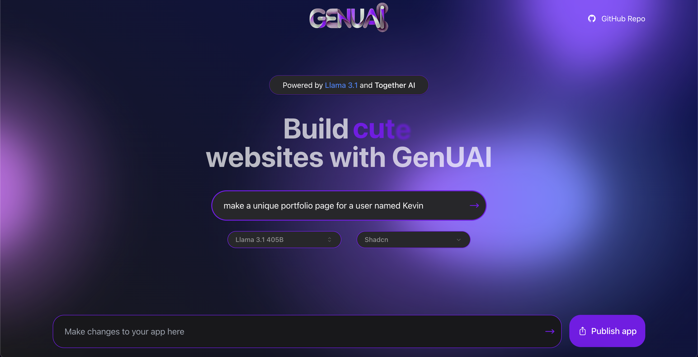

<a href="https://www.KevIsDev.io">
  
  <h1 align="center">GenUAI</h1>
</a>

  An open source Claude Artifacts forked and adapted from llamacoders original repo – generate small apps with one prompt. Powered by Llama 3 405B & Together.ai.

## Tech stack

- [Llama 3.1 405B](https://ai.meta.com/blog/meta-llama-3-1/) from Meta for the LLM
- [Together AI](https://dub.sh/together-ai/?utm_source=example-app&utm_medium=KevinMcgivern&utm_campaign=KevinMcgivern-app-signup) for LLM inference
- [Sandpack](https://sandpack.codesandbox.io/) for the code sandbox
- Next.js app router with Tailwind
- Shadcn, Aceternity, MagicUI for UI elements.
- Helicone for observability
- Plausible for website analytics

## Cloning & running

1. Clone the repo: `git clone https://github.com/Nutlope/llamacoder`
2. Create a `.env` file and add your [Together AI API key](https://dub.sh/together-ai/?utm_source=example-app&utm_medium=KevinMcgivern&utm_campaign=KevinMcgivern-app-signup): `TOGETHER_API_KEY=`
3. Run `npm install` and `npm run dev` to install dependencies and run locally

## Future Tasks
- [ ] Accounts.
    - [x] Auth.
    - [x] Database.
    - [ ] User Usage.
    - [ ] Free Tier on signup.
    - [ ] Manage payment.
    - [ ] Manage prompt amount and limit.
- [ ] Premium/Pro plan.
    Features:
    - [ ] Multiple libraries at once.
    - [ ] Increased token amount monthly.
    - [ ] Theme selection.
    - [ ] Access to premium models.
    - [ ] Access to paywalled libraries.
- [x] Library choice.
- [ ] Add more libraries.
    [x] AceternityUI
      - [ ] Produce all documents.
    [ ] MagicUI
    [ ] SyntaxUI
- [ ] Dynamic styling for all libraries compared to prestyled.
- [ ] Improved handling of images, icons etc for a better preview of generated code.
- [ ] Improve system prompt max token limit or find alternative.
- [?] Use all library components from a custom npm package that provides these from a single import path. Example: import {Button, Card, Input } from "multi-ui-bundle" .
- [x] Enhanced responses from AI preventing bundle imports in single path etc.
- [x] Latest Shadcn components can now be used.
- [x] Overall design change
- [ ] Handle and show history of previous generated apps.
- [ ] Experiment with a prompt rewriter and launch this as well
- [ ] Make the toast that opens better like a modal for sharability
- [ ] Add sharability to people can take their apps and share them publicly
- [ ] Address issue of ability to publish the same app repeatedly
- [ ] Try chain of thought reasoning to see if it works better overall
- [ ] Encourage best practices by making the input and textarea & having pills to generate apps w/ good prompts
- [ ] Add more customizability in terms of changing the prompt, temperature, ect...
- [ ] Could be nice to show a "featured apps" route on the site on /featured. Have a /id/${prompt} dynamic route that can display a bunch of nice example apps in the sandbox ready to go
- [ ] Support more languages starting with Python, check out E2B
- [ ] Try chain of thought reasoning to see if it works better overall
- [ ] Try finetuning a smaller model on good prompts from 405b or GPT-4/Claude
- [ ] Add dark mode to the site overall, nice design change
- [ ] Surface errors better in codesandbox to the user so people know what is wrong
- [ ] Have 405B correct itself (sometimes it makes up imports)
- [ ] New route for updateCode that only sends the latest generated code + the modify request
- [ ] Fix bug where if a user edits the code, then does a change, it doesn't use the edited code
- [ ] Add rate limiting with redis upstash if the traffic gets too high
- [ ] Apply code diffs directly instead of asking the model to generate the code from scratch
- [ ] Add the ability to upload things like a screenshot for it to start from that
- [ ] Add a documentation route.
- [ ] Add bug/feedback reports.

## Contribution 

- llamacoder for providing the original repo to work from.
